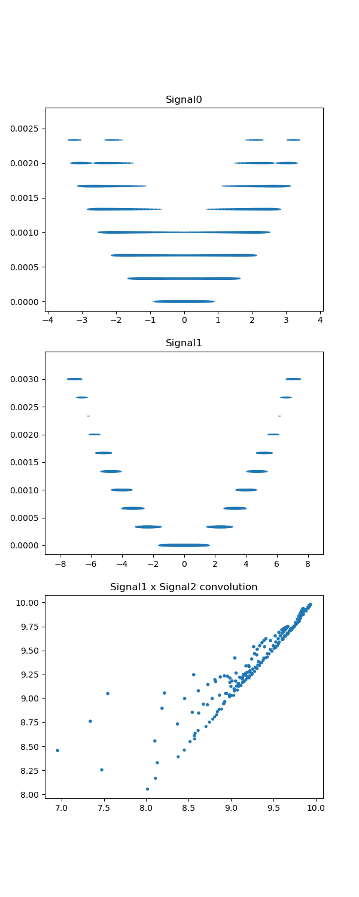
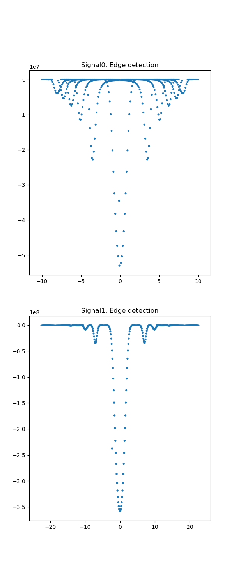

###Assessment: "convolve_raw_*.dat" (attached) have data arranged in 3 columns.
1) Column 1 and 2 designate x and y coordinates respectively. 
2) Column 3 is the main data defined at the corresponding (x, y) points.
3) Compute the 2-d convolution of these data and provide visualization.
4) Use any programming language or library as necessary.

#### For the solution of this problem, I applied scipy.convolution2D function

The result is shown on Fig.1

 

On on Fig.2, the result shows an attempt to apply an edge detector filter to both data files 

 
