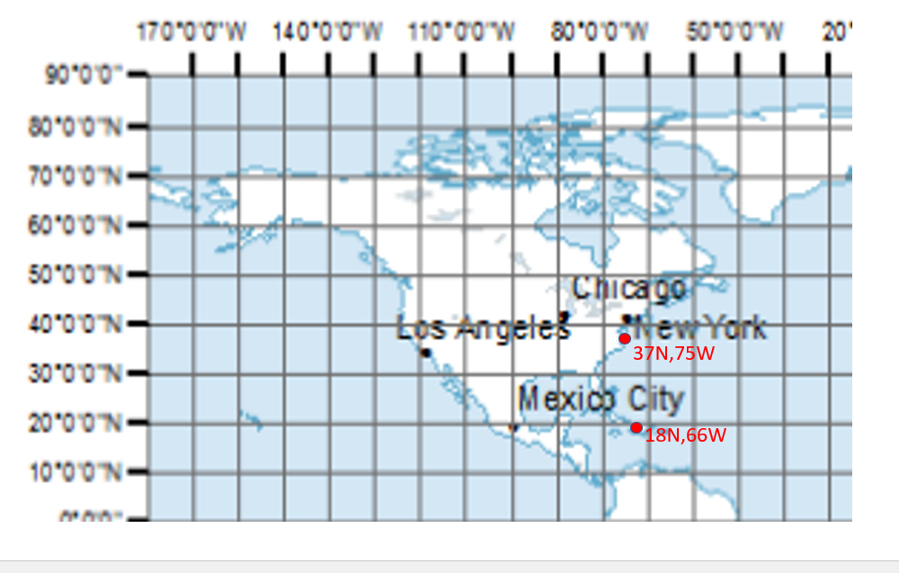
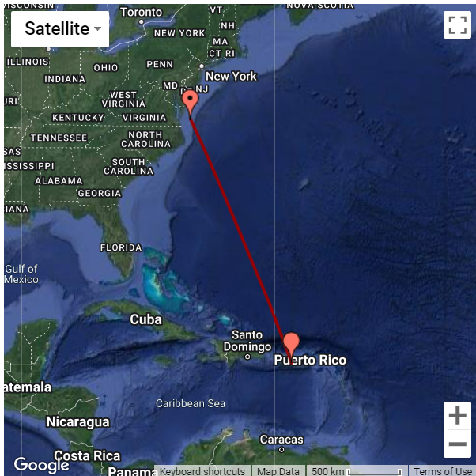

#### Assessment Coordinate Transformation: Implement coordinate conversion utilities that can convert radar coordinates (bearing, range) to GIS coordinates (lat, lon) and vice versa in C. The header declaration could be the following or your own design. 
```
int GIS2Radar(double *range, 
	      double *bearing, 
              double glonInit, 
              double glatInit, 
              double glonFinal, 
              double glatFinal);
```
```
int RtoG (double range, 
          double bearing, 
          double  glonInit, 
          double glatInit, 
          double *glonFinal, 
          double *glatFinal);
```

You can use the following as the location of interest

Initial: Wallops Islands, lat: 37N, long: 75W) 

Final: Puerto Rico, lat: long: 18N, 66W) 



#### MY SOLUTION based on [1]

I checked publications, internet and found coordinate transformations pieces of implemented in Javascript, C on [1][2][3][4][5].

#### My solution based on use of the Haversine formula [1]

>The haversine formula determines the great-circle distance between two points on a sphere given their longitudes and latitudes. Important in navigation, it is a special case of a more general formula in spherical trigonometry, the law of haversines, that relates the sides and angles of spherical triangles.[1]

### Haversine is defined by 

$hav(\theta) = \sin^2(\frac{\theta} {2})$

Let the central angle θ between any two points on a sphere be:

$\theta ={\frac {d}{r}} $

where:

d is the distance between the two points along a great circle of the sphere (see spherical distance),
r is the radius of the sphere.

The haversine formula allows the haversine of θ (that is, hav(θ)) to be computed directly from the latitude (represented by φ) and longitude (represented by λ) of the two points without using cosines which cause resolution degradation at small angles

$hav(\theta ) =  hav(\varphi _{2}-\varphi _{1}) + (1- hav(\varphi _{1}-\varphi _{2})- hav(\varphi _{1}+\varphi _{2})) * hav(\lambda _{2}-\lambda _{1})$

where

$\varphi _1, \varphi _2$  are the **latitude** of point 1 and **latitude** of point 2,

$\lambda _1, \lambda _2$  are the **longitude** of point 1 and **longitude** of point 2.

Finally, the haversine function hav(θ), applied above to both the central angle θ and the differences in latitude and longitude, is

$hav(\theta) = \sin^{2} (\frac {\theta} {2}  ) = \frac {1-\cos(\theta)} {2} $

To find distanse between two points one can use  (inverse haversine)

$d\ = r\ archav(h) = 2\ r\ \arcsin(\sqrt{h})$

or explicitly

$d\ =\  2r\ \arcsin(  \sqrt{\sin^2(\frac {\varphi _2-\varphi _1}{2}) + \cos(\varphi _1) \cdot \cos(\varphi _2) \cdot \sin^2(\frac {\lambda _2-\lambda _1}{2}) }    )    $

#### I used the assumption that Earth's shape is spheroidal with radius = 6371e3 m ( in case of elipsoidal Earth sahe model calculations are  more complicated [4]).

Implemented solution is based of spherical shape of the Earth which gives according to Ref.1 0.5% of error.

I used existing JavaScript implementation of coordinate transformations to create C functions [2].

To transform GIS to the radar coordinates we created two functions in C: GIS2Radar.c and RtoG.c

Using the required parameters (Initial: Wallops Islands, lat: 37N, long: 75W) 

Final: Puerto Rico, lat: long: 18N, 66W)) we can calculate coordinates transformation from GIS to radar and radar to GIS

#### I created Makefile to compile, link and test both functions GIS2Radar and RtoG using two test programs: test_GIS2Radar.c and test_RtoG.c

Below content of the Makefile is listed:

```
all: test_GIS2Radar.out, test_RtoG.out

#### GIS2Radar section of makefile

test_GIS2Radar.out: test_GIS2Radar.o
	 gcc -o test_GIS2Radar.out test_GIS2Radar.o GIS2Radar.o -I ./GIS2Radar.h -lm

test_GIS2Radar.o: test_GIS2Radar.c
	 gcc -c test_GIS2Radar.c  -I./GIS2Radar.h

GIS2Radar.o: GIS2Radar.c 
	 gcc -c GIS2Radar.c -I. GIS2Radar.h


#### RtoG section of makefile
     
test_RtoG.out: RtoG.o
	 gcc -o test_RtoG.out test_RtoG.o RtoG.o -I ./RtoG.h -lm

test_RtoG.o: test_RtoG.c
	 gcc -c test_RtoG.c  -I ./RtoG.h

RtoG.o: RtoG.c 
	 gcc -c RtoG.c -I. RtoG.h

clean:
	 rm GIS2Radar.o RtoG.o  mainflux.out
```

#### Using this Makefile one can create executables of test_RtoG.out and test_GIS2Radar.out

**Build of test_GIS2Radar.out **

```
[userdir]$ make GIS2Radar.o
```

```
[userdir]$ make test_GIS2Radar.o
```
```
[userdir]$ make test_GIS2Radar.out
```
### Run executable
```
[userdir]$./test_GIS2Radar.out
```
Program will ask you to input nessessary information on the console.

#### The example of input GIS Coordinates and output of Radar Coordinates is shown below

```
[vmakhin@localhost Assessment_Coordinate_Transformation]$ ./test_GIS2Radar.out

Initial Point GIS coordinates (latitude and longitude):

Input value of latitude at Initial Location(in degrees):
37.

glatInit= 37.000000 , in degrees

Input value of longitude at Initial Location(in degrees):
75.

glonInit= 75.000000 , in degrees

Final Point GIS coordinates (latitude and longitude):

Input value of latitude at Final Location(in degrees):
18.

glatFinal= 18.000000 , in degrees

Input value of longitude at Final Location(in degrees):
66.

glonFinal= 66.000000 , in degrees

range= 2288.663608 , in km

bearing= 205.036783 , in degrees

[vmakhin@localhost Assessment_Coordinate_Transformation]$
```

**I compared my results with Ref[2]. using provided for this task coordinates

=== THIS is NOT MY results !!!! I tried to make comparison with it 



I got some discrepancy in comparison of my and published on internet results and trying to resolve them.


### In similar way I created exceotable for test_RtoG.c and run it with commnd

'''
[userder]$./test_RtoG.out
```

### Example of use test_RtoG is below:

```
[vmakhin@localhost Assessment_Coordinate_Transformation]$ ./test_RtoG.out
Initial Point GIS coordinates (latitude and longitude):

Input value of latitude at Initial Location(in degrees):
37.

glatInit= 37.000000 , in degrees

Input value of longitude at Initial Location(in degrees):
75.

glonInit= 75.000000 , in degrees

Input value of Initial Point Radar Coordinates:

Input value of range at Initial Location(in m):
2289000.

range= 2289000.000000 , in m

Input value of bearing at Initial Location(in degrees):
155.

bearing= 155.000000 , in degrees

Final Point GIS coordinates (latitude and longitude):

glatFinal= 17.992579 , in degrees

glonFinal= 83.988418 , in degrees

```
I have discrepancy with test and I am working on to remove discrepancy.

### References
1. https://en.wikipedia.org/wiki/Haversine_formula#cite_note-Brummelen_2013-1
2. http://www.movable-type.co.uk/scripts/latlong.html
3. http://www.jaimerios.com/?p=39
4. https://en.wikipedia.org/wiki/Vincenty%27s_formulae
5. Ed Williams, Aviation Formulary, V.1.5, http://www.edwilliams.org/avform147.htm

**The users can get help with their projects sending email to:** 
      
     vmakhin@gmail.com 
      
**Who maintains and contributes to the project:** 
      
     Volodymyr Makhin,  
     Sr. Computational Physicist 
