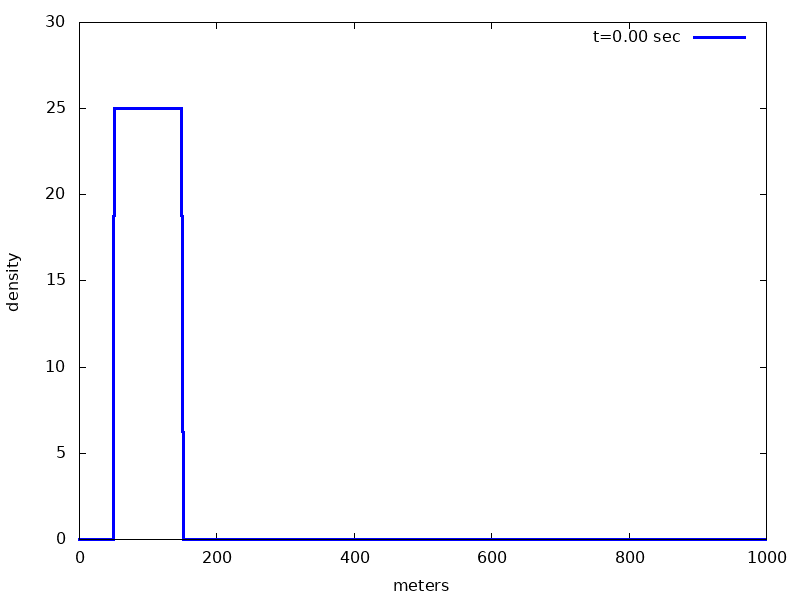

## Assessment of modeling fluid dynamic (advanced and hard): 
Transport a square wave across a 1-D structured grid.  Use operator splitting for the continuity and momentum equations with no forcing terms:

∂_t ρ+ ∂_x (ρv)=0

∂_t (ρv)+ ∂_x (ρvv)=0

Instructions:

Use a structured grid that has 1000 grid cells, with a cell width of 1.0 meters.  All variable values are stored in the cell centers.
Width of a square wave should cover at least ten grid cells. 
Recommend testing with a square wave that covers 100 grid cells (see example gif below)

Use a CFL condition where C_max<0.5 .
Use positive velocity of 10.0 m/s. 
Use a density value of 25.0 .
Only transport density values > 1.0e-6

Use the given C code that implements the flux-correct method for transporting quantities

Compile C code using a Makefile

Create a gif visualization that shows 10 seconds of simulation time

## My solution of this task

### System of continuity and momentum equations:

$\frac{\partial \rho}{\partial t} + \frac{\partial (\rho v)}{\partial x} = 0$

$\frac{\partial \rho v}{\partial t} + \frac{\partial (\rho v v)}{\partial x} = 0$

### To solve this system of equations using flux-correction method I went through several publications [1],[2],[3],[4]

#### I created Makefile (included in the folder):

```
all: mainflux.out

mainflux.out: mainflux.o
	 gcc -o mainflux.out mainflux.o flux_corrected_transport.o -I ./flux_corrected_transport.h

mainflux.o: mainflux.c 
	 gcc -c mainflux.c -I. flux_corrected_transport.h
     
flux_corrected_transport.o: flux_corrected_transport.c
	 gcc -c -std=gnu99 flux_corrected_transport.c -I. flux_corrected_transport.h

clean:
	 rm mainflux.o flux_corrected_transport.o mainflux.out
```

#### I followed next steps to create a gif animated file using provided _flux_corrected_transport.c_ function

1. **Created an object file from flux_corrected_transport.c C file**
```
[userdir]$make flux_corrected_transport.o
```
2. **Created mainflux.o object file**
```
[userdir]$make mainflux.o
```
3. **Created the executable mainflux.out**
```
[userdir]$make maneflux.out
```
4. **Ran a mainflux.out executable file**
```
[userdir]$./mainflux.out
```

After step 4 file with the name densityvstime.txt was generated.

#### To CREATE a gif animated movie, I typed on the console:
```
[userdir]$gnuplot < gif_animation_density.gnu
```
> This will produce a densityvsx.gif file for the 10 sec as requested in this task; this uses an animate.gnu file  

The animation of the Density Spatial Profile vs Time until 10 sec is presented below  



### References

1. Boris J.P., Book D.L. (1976) Solution of continuity equations by the method of flux-corrected transport. Controlled Fusion, 85-129.

2. D.L.Book, J.P.Boris , K.Hain Flux-corrected transport II: Generalizations of the method. Journal of Computational Physics, Volume 18, Issue 3, July 1975, Pages 248-283

3.  Boris J.P., Book D.L. Flux-Crrected Transport. I.SHASTA A Fluid Transport  ALgorithm That Works. Journal of Computational Physics, Volume 11, 1973, Pages 38-69

4. J.P. Boris, A.M. Landsberg, E.S. Oran, J.H. Gardner, LCPFCT-A Flux-Corrected Transport Algorithm for Solving Generalized
Continuity Equations,  APril 1993, Report NRL/MR/6410--93-7192


