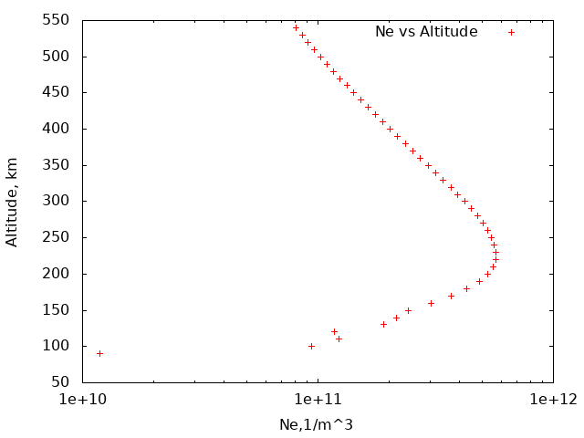

### Assessment IRI EDP:  
     Create a C-based modeling and simulation program that drive IRI model Fortran code. The code should capture and generate vertical  
     EDP (Electron Density Profile) for a given time and location of interest.  
      
##### What the project does? 
      
> Creates a C-based modeling and simulation program that drive IRI model Fortran code. C Modeling interface captures and generates DEP (Electron Density Profile) for a given time and location of interest. 
      
###### Why the project is useful? 
      
> This project creates a new capability to visualize results of **iri2016 Fortran** modeling by  
     using Gnuplot interface with ANSI C (gnuplot_i). This project will simplify graphical representation of the Fortran IRI modeling results. 
      
###### How users can get started with the project? 
      
> We created set of scripts which allow users by  using them **download necessary files, compile, link them and create excecutables** 
      
###### Requirements 
      
     1. Linux CENTOS 7 
     2. GCC (gcc and gfortran compilers) 
     2. F2c Utility 
     3. Gnuplot 
     4. gnuplot_i ANSI C interface to Gnuplot (installed by using included bash scripts) 
     5. wget utility 
      
** Get Fortran Files of IRI Project Using Created in This Project bash script ** 
      
** Set execute permission to the script ** 
``` 
     [userdir]$chmod +x download_iri.sh 
``` 
##### Run script 
``` 
     [userdir]$./download_iri.sh 
``` 
      
**After successful run of this script all files  
     for Fortran iri project will be in current folder ** 
      
<span style="color:red">*ALTERNATIVELY ONE COULD DOWNLOAD FILES FOR IRI PROJECT MANUALLY*</span>. 
    
**THIS STEP Could Be Skipped Until The  Section of This README file  
DOWNLOAD and CREATE OBJECT FILE gnuplot_i.o  FROM gnuplot_i.c and gnuplot_i.h files** 
      
#### On the first step one should download iri2016 model 
     from International Reference Ionosphere webpage  irimodel.org [iri2016 model](http://irimodel.org/IRI-2016/). 
      
**Below is detailed description what script download_iri.sh does** 
      
Using ***wget*** utility download ***00_iri.tar*** file with iri2016 model 
      typing on Linux computer line: 
``` 
     [userdir]$ wget https://irimodel.org/IRI-2016/00_iri.tar  
``` 
      
     One will see output similar to this: 
``` 
      
     --2022-11-03 20:41:08--  https://irimodel.org/IRI-2016/00_iri.tar 
     Resolving irimodel.org (irimodel.org)... 216.194.169.102 
     Connecting to irimodel.org (irimodel.org)|216.194.169.102|:443... connected. 
     HTTP request sent, awaiting response... 200 OK 
     Length: 3512320 (3.3M) [application/x-tar] 
     Saving to: ‘00_iri.tar’ 
      
     100%[=================...============>] 3,512,320   8.62MB/s   in 0.4s 
      
     2022-11-03 20:41:09 (8.62 MB/s) - ‘00_iri.tar’ saved [3512320/3512320] 
``` 
##### Check if file _00_iri.tar_ is in the folder 
```  
     [userdir]$ ls 
      
     00_iri.tar  README.md 
``` 
##### Untar (extract files) files from  this file using command: 
``` 
     [userdir]$ tar -xvf 00_iri.tar 
``` 
***One will see list of files after extraction of files from tar file*** 
``` 
     [userdir]$ ls 
``` 
``` 
     00_iri2016-License.txt  dgrf1945.dat  dgrf1970.dat  dgrf1995.dat  igrf2020.dat   irifun.for        iritest.for  mcsat15.dat  mcsat20.dat 
     00_iri.tar              dgrf1950.dat  dgrf1975.dat  dgrf2000.dat  igrf2020s.dat  irirtam.for       mcsat11.dat  mcsat16.dat  mcsat21.dat 
     00readme.txt            dgrf1955.dat  dgrf1980.dat  dgrf2005.dat  igrf.for       irirtam-test.for  mcsat12.dat  mcsat17.dat  mcsat22.dat 
     00_update_history.txt   dgrf1960.dat  dgrf1985.dat  dgrf2010.dat  iridreg.for    irisub.for        mcsat13.dat  mcsat18.dat  README.md 
     cira.for                dgrf1965.dat  dgrf1990.dat  dgrf2015.dat  iriflip.for    iritec.for        mcsat14.dat  mcsat19.dat 
``` 
      
##### Inside the **00readme.txt** one can find full description of the Fortran subroutines and extracted data files 
      
_It is also required to download additional files:_ 
      
_at http://irimodel.org/indices/:_ 
      
>ig_rz.dat       This file(s) contains the solar and ionospheric indices (IG12, Rz12) 
>                for the time period from Jan 1958 onward. The file is updated 
>                quarterly. It is read by subroutine tcon in irifun.for (ASCII). 
>                [This file will be updated at close to quarterly intervals] 
>apf107.dat      This file provides the 3-hour ap magnetic index and F10.7 daily 
>                81-day and 365-day index from 1960 onward (ASCII). 
>                [This file will be updated at close to quarterly intervals] 
                      
>Daily updates of these two files are available from the ECHAIM website (David 
Themens) as described on irimodel.org. 
      
>At http://irimodel.org/COMMON_FILES/: 
>CCIR%%.dat              Monthly coefficient files for the CCIR foF2 and M(3000)F2 models 
                     %%=month+10 
>URSI%%.dat              Monthly coefficient files for the URSI foF2 model 
                     %%=month+10 
       
      
### We will download files using wget utility: 
``` 
     [userdir]$wget http://irimodel.org/indices/ig_rz.dat 
      
     [userdir]$wget http://irimodel.org/indices/apf107.dat 
      
     [userdir]$wget http://irimodel.org/COMMON_FILES/00_ccir-ursi.tar 
      
     [userdir]$tar -xvf 00_ccir-ursi.tar 
``` 
<span style="color:red">*END of SECTION of DOWNLOAD FILES FOR IRI FORTRAN PROJECT MANUALLY*</span>. 
      
#### Download and Create Object File **gnuplot_i.o**  using gnuplot_i.c and gnuplot_i.h files from gnuplot_i distribution, 
``` 
     [userdir]$ download_gnuplot_i.sh 
``` 
     This script downloads from  [gnuplot_i] web page gnuplot_i ANSI C **source code**, 
**compile** it and creates **gnuplot_i.o** object file 
      
     It will create folder with name ***gnuplot_i_iri*** 
     with gnuplot_i.o and gnuplot_i.h files which will be used to create ***gnuplot*** charts 
     with iri generated data 
      
#### Generate IRI2016 code running and plotting gnuplot of DENSITY vs HEIGHT 
      
     Copy from subfolder iri_driver two files to main folder: 
***iri_driver_main.c and iri_driver_sub.for*** 
``` 
     [userdir]$cp iri_driver/iri_driver_main.c  
     [userdir]$cp iri_driver/iri_driver_sub.for  
``` 
     After that run three make commanda: 
      
##### Create SHARED IRI library from Fortran subroutines 
``` 
     [userdir]$make create_shared_lib77 
``` 
#### Create object file for function iri_driver_main.c with ANSI C request to plot GNUPLOT chart 
      
     This interface was built using gnuplot_i ANSI C interface [gnuplot_i](http://ndevilla.free.fr/gnuplot/). 
      
     In this function  we define interaction with GNUPLOT library using gnuplot_i.o 
     object file 
      
``` 
     [userdir]$make iri_driver_mainc 
``` 
     #### NEXT step is to use make command to create executable: 
``` 
     [userdir]$make test_gfortranmain 
``` 
      
     ##### After run this generates executable file test_gfortranmain.out 
      
     We will run it using command: 
``` 
     [userdir]$./test_gfortranmain.out 
``` 
     This command will call ***IRI2016 model*** and produce ***GNUPLOT chart*** 
      
     If we use ***set terminal X11*** plot will stay open until 
     press q on keyboard or close chart using X on the right corner of window with chart. 
      
     In current setup *** code will produce PNG file*** in the folder. 
      
     Example of the PNG image format file generated by using gnuplot with **set terminal PNG** 
      
 
      
     In order to produce file with image one need to change type of terminal. 
      
<!-- ['Electron Density vs Altitude'](NevsH.png) --> 
      
**This is limited version of code to produce EDP (Electron Density Profile)** 
**for a given time and location of interest** 
      
     EXAMPLE of OUTPUT is NevsH.png file is in the current folder 
      
**WORK is IN PROGRESS to extend capabilities of this set of functions and subroutines** 
      
**As a Result of This project** 
     We created tar file with all script files to build IRI2016 model 
      
     and produce chart of  Electron number density vs height from 60 to 600 km. 
      
**The users can get help with your project sending email to:** 
      
     vmakhin@gmail.com 
      
**Who maintains and contributes to the project:** 
      
     Volodymyr Makhin,  
     Sr. Computational Physicist 
 


