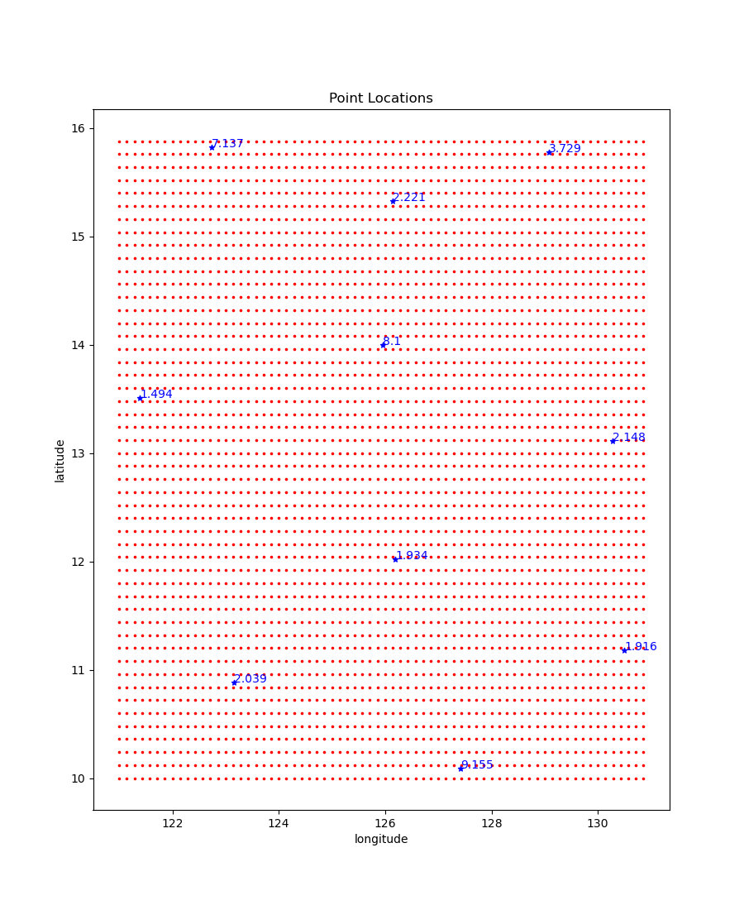
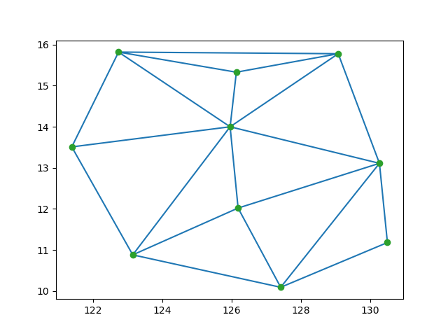
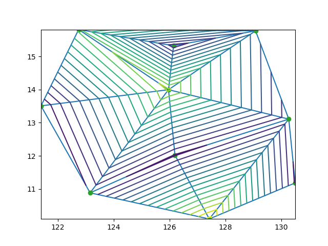
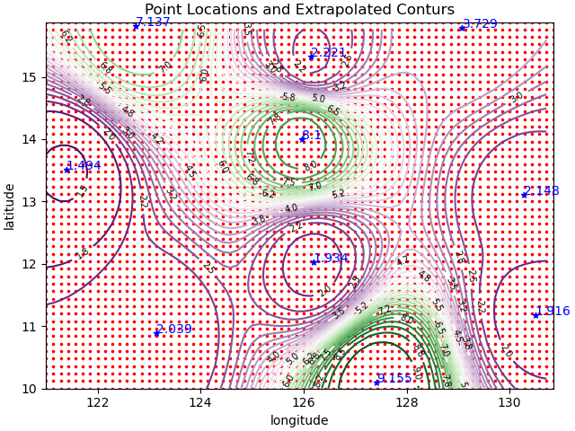
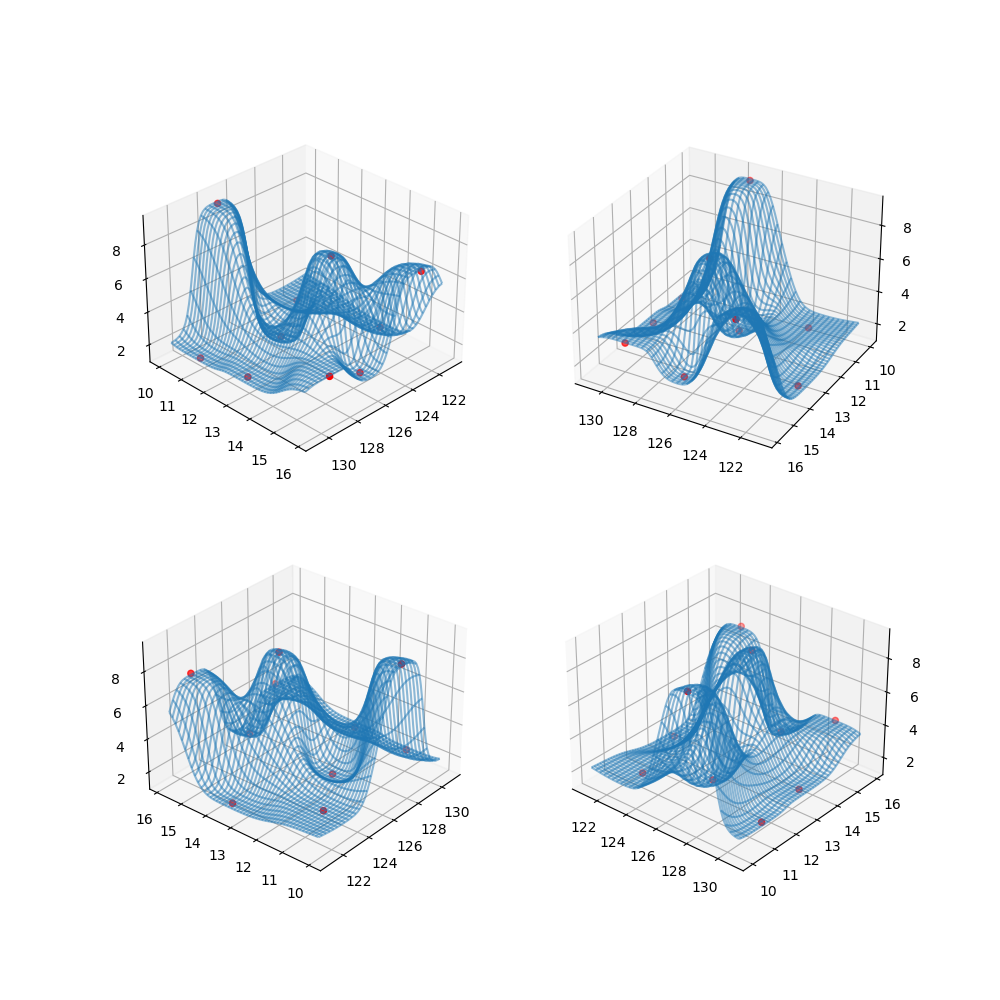

### Assessment Interpolation

Using any language and plotting packages you like, interpolate
the given point location values to a structured grid of longitude
 and latitude locations. This task will ask the candidate to implement
 a procedure that interpolates known grid points and values
 to a structured grid

### Solution:

For the solution of this problem, I used Python language and third-party tools.
I applied several methods to solve this problem.

Point locations are shown on Fig1.

On the first approach I applied Delaunay triangulation from Scipy library.
Point Locations are shown is on Fig. 2

 

Using the area coordinates inside of each triangle and values at the corners of
 triangles with application of linear interpolation function I got first result
on Fig3.

 

### This approach gives very rough representation of variable Value. 

This approach doesn’t consider values outside Delaunay triangles.
Another limitation of this approach is very limited extrapolation capabilities
 outside area covered by triangles.
 
### Second approach I used was based on applying nearest analysis with original kriging method with spherical variogram model.

I used publicly available Python tool **PyKrige.**

This method involves coordinates of points with known values and whole set of values
 in these points to create interpolation object over whole rectangular area.
 On Fig.4 and Fig.55 we can see final result of our application of nearest approximation
 using kriging function
 
 

and Fig.5 3D visualization of interpolation

